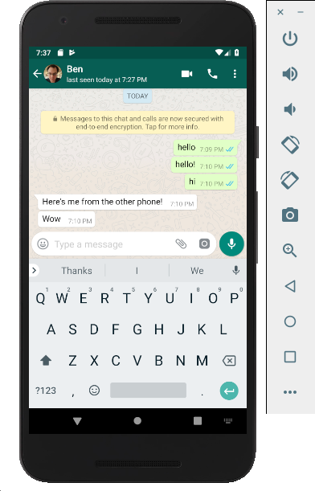
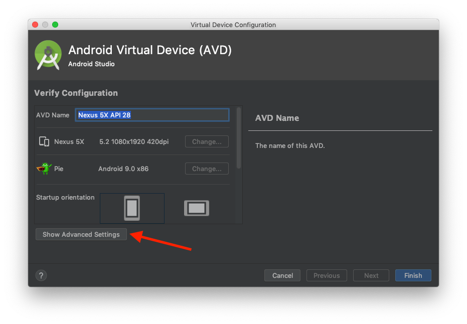
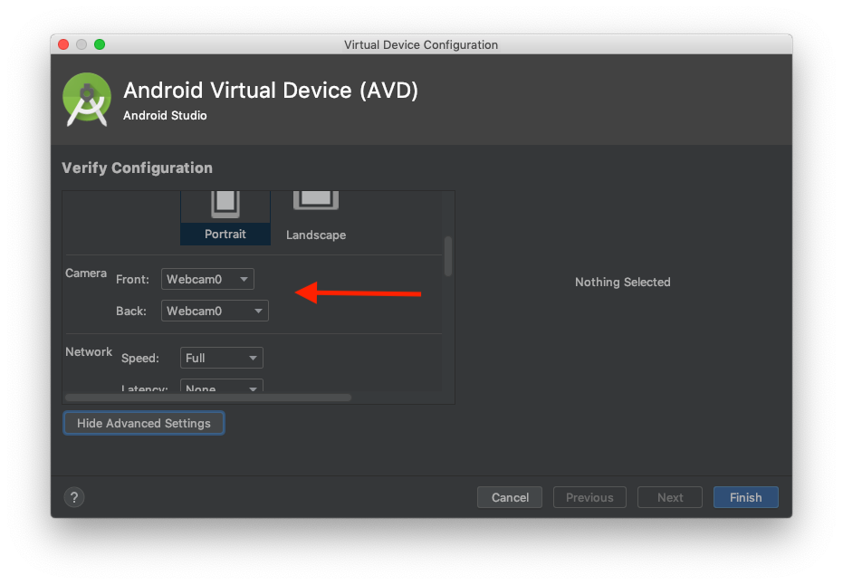

# Bridging Matrix with WhatsApp running on a VM

Matrix is:

> an open standard for *interoperable*, *decentralised*, *real-time communication*.

In this article we'll benefit from all three of these attributes:

* *interoperable:* we'll see how Matrix can be made to interact with WhatsApp
* *decentralised*: you can perform this on your own server while still enjoying the benefits of being connected to the rest of the Matrix federation
* *real-time communication*: we'll see how to send and receive messages in real-time

## Install your homeserver and install mautrix-whatsapp, the WhatsApp bridge

Firstly, you need to have a Matrix homeserver installed. If you don't currently have one, take a look at the instructions at [Installing Synapse][installing-synapse], and also in the [Synapse README][Synapse].

Next, install [mautrix-whatsapp] by following the instructions at [mautrix-whatsapp/wiki].

If you are starting from scratch, I suggest you take a look at [matrix-docker-ansible-deploy], as this project will enable you to deploy Synapse, [mautrix-whatsapp] and other components easily.

For example, if you have an existing deployment using [matrix-docker-ansible-deploy], you can add [mautrix-whatsapp] simply by adding the following line to your configuration file:

```yaml
matrix_mautrix_whatsapp_enabled: true
```

... and re-running the setup:

```unix
ansible-playbook -i inventory/hosts setup.yml --tags=setup-all
```

Either way, you will soon have a functioning Matrix Synapse homeserver and [mautrix-whatsapp] installed with it. Next, we will set up an Android VM.

## Set up an Android VM

The best way to run an Android Virtual Machine is to use the Android Studio tools from Google. First, [install Android Studio](https://developer.android.com/studio/install), making sure to follow the post-install steps, as they will install additional tools we need, including AVD Manager.

Once installed, run AVD manager by choosing `Tools -> AVD Manager` from the menu.

Follow the steps to create a new virtual machine, in this example I have a Nexus 5X running Android 9, but almost any configuration is fine here. Make sure that you give the device access to the Play Store.


## Install WhatsApp and sign-in

Launch the Virtual Device, the open the Play Store and sign in. Now use the Play Store to install WhatsApp on the Virtual Device.

You will be asked to verify your phone number, use your number on another device to complete this step.



## Setup mautrix-whatsapp bridge

Now that you have WhatsApp working in a VM, and Matrix working on your server, it's time to bridge them togther!

Per the instructions at [mautrix-whatsapp/wiki], you must start a new chat with **@whatsappbot:*yourdomain*>**. Type `login` to begin the authentication process.

mautrix-whatsapp operates by using the WhatsApp Web feature of WhatsApp - which means it uses a QR code that you must now scan on the device running WhatsApp - which in your case is the AVD. In order to scan the presented QR code, set your AVD camera to passthrough the camera device on your host machine - see the images below.




Once this is complete, you can type `sync`, to start bridging contacts, and `sync --create` to automatically create room invites.

And that's it! You may need to take a little time to watch the sync happen, particularly if you have a very large number of chats on the WhatsApp side, but there is no further configuration needed.

<iframe width="560" height="315" src="https://www.youtube.com/embed/edSgP2dEZ1o" frameborder="0" allow="accelerometer; autoplay; encrypted-media; gyroscope; picture-in-picture" allowfullscreen></iframe>

[installing-synapse]: https://matrix.org/docs/guides/installing-synapse
[mautrix-whatsapp]: https://github.com/tulir/mautrix-whatsapp
[Synapse]: https://github.com/matrix-org/synapse
[matrix-docker-ansible-deploy]: https://github.com/spantaleev/matrix-docker-ansible-deploy/
[mautrix-whatsapp/wiki]: https://github.com/tulir/mautrix-whatsapp/wiki