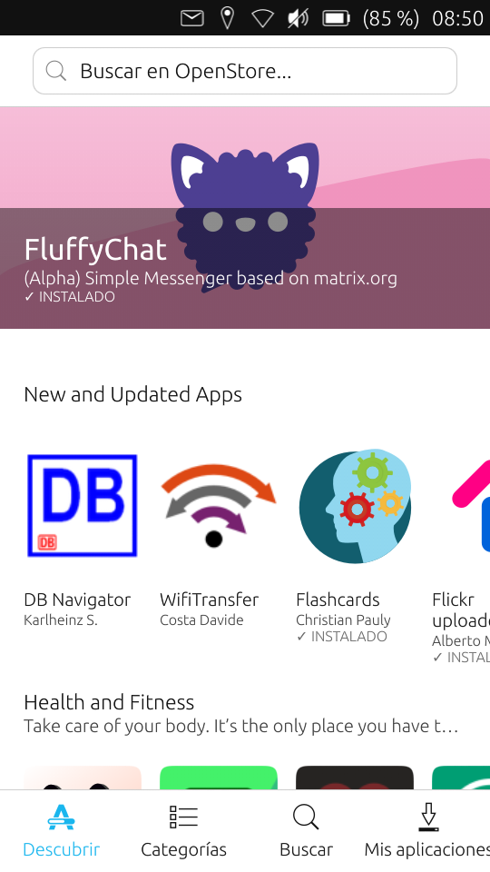

# This Week in Matrix 2018-09-21

## Nheko 0.6.0 released!

Get [latest stable releases from GitHub](https://github.com/mujx/nheko/releases/v0.6.0).

### Features

* Support for sending & receiving markdown formatted messages.
* Import/Export of megolm session keys. (Incompatible with Riot)
* macOS: The native emoji picker can be used.
* Context menu option to show the raw text message of an event.
* Rooms with unread messages are marked in the room list.
* Clicking on a user pill link will open the user profile.

## Spec Proposals: E2E Cross-signing and bi-directional key verification

[uhoreg] has written up a new [work-in-progress proposal for E2E cross-signing](https://github.com/matrix-org/matrix-doc/pull/1681).

> Also, although it wasn't this week, I don't think that we have previously announced the proposal for bi-directional key verification using QR codes: <https://github.com/matrix-org/matrix-doc/pull/1544>

## Jeon

Massive update from [ma1uta] about his [Jeon] project! This update brings Jeon into line with the most recent updates to the Client-Server, Application Service, Push and Identity APIs.

In ma1uta's words:

> Jeon is a set of the java interfaces and classes which describes the Matrix API.
> 
> * client-api: r0.4.0-1 corresponds to the r0.4.0 C2S API.
> * application-api: r0.1.0-1 corresponse to the r0.1.0 AS API,
> * push-api: r0.1.0-1 corresponds to the r0.1.0 PUSH API,
> * identity-api: r0.1.0-1 corresponds to the r0.1.0 IS API.\nAll artefacts available from the Maven Central Repository.\nMajor changes:
> * Full support for the corresponding Matrix api.
> * Changed version for displaying the Matrix api version.
> * Added support to the asynchronous responses.
> 
> Also updated the swagger schemas generated from the code:
> * <https://ma1uta.github.io/swagger/c2s.json> - C2S API
> * <https://ma1uta.github.io/swagger/as.json> - AS API
> * <https://ma1uta.github.io/swagger/push.json> - PUSH API
> * <https://ma1uta.github.io/swagger/id.json> - IS API

> And the first hotfix: application-api r0.1.0-2 with fixed url (/transactions has been changes to the _matrix/app/v1/transactions). And this release will break all AS because synapse sends transactions to the old url.

Join [#jeon:matrix.org] to discuss the progress of this product more.

## VoIP signalling support has landed in libQMatrixClient

Exciting times for [libQMatrixClient]!! Thanks [kitsune], developer of libQMatrixClient and [Quaternion]:

> After some pretty long time of being in a PR/fork, VoIP signalling support has landed in libQMatrixClient! Many thanks to mariogrip (the founder of UBports) for the initial code and to delijati (a developer behind [uMatriks]) for getting it to work with the most recent library.  
> The actual VoIP stack does not come included, client developers have to take whatever WebRTC implementation is available for their platform and glue the pieces together. However, as the example of uMatriks shows, this now becomes relatively easy if your platform is on good terms with WebRTC (like UBports). I look forward to further work with UBports community on keeping this platform a first-class Matrix citizen.

Go chat in [#quaternion:matrix.org] to see the ways libQMatrixClient is developing.

## Matrique is now Spectral

After intense discussion, there is a new name for Matrique: **Spectral**. The repo now sites at <https://gitlab.com/b0/spectral>, there is a new room at [#spectral:encom.eu.org], and a new logo:

## FluffyChat featured in OpenStore

[FluffyChat] is getting some love from OpenStore, the official Ubuntu Touch app store: this week it was the featured app.

## Matrix Corporal

[@slavi:devture.com], creator of [Matrix Corporal] (a Matrix server configuration tool - "Kubernetes for Matrix"):

> [Matrix Corporal] has received [some updates](https://github.com/devture/matrix-corporal/blob/2c65b573261cc19c3a0a1cb10168257b953200e8/CHANGELOG.md) over the past few weeks since its initial release: a couple of additional HTTP APIs for retrieving/destroying user access tokens; more consistency with the Matrix Client-Server specification when it comes to error responses; faster reconciliation for user accounts that are joined to many/large rooms.

## matrix-docker-ansible-deploy

Another project from [@slavi:devture.com], for those who prefer their DevOps ansible-flavoured:

> [matrix-docker-ansible-deploy] now also helps you [set up service discovery](https://github.com/spantaleev/matrix-docker-ansible-deploy/blob/master/docs/configuring-well-known.md) as per the [.well-known Matrix specification](https://matrix.org/docs/spec/client_server/r0.4.0.html#server-discovery).

## jcg ansible PR for matrix notifications

jcg has an [upstream PR to have matrix notifications in ansible](https://github.com/ansible/ansible/pull/45823). Combined with Slavi's [matrix-docker-ansible-deploy] above, you can get Matrix notifications about issues with your Matrix deployment...

## Seaglass E2E + self-update

[neilalexander]:

> [Seaglass] end-to-end encryption support is now complete, including device verification and blacklisting, key sharing requests, key import and export (which should be compatible with Riot) and re-requesting keys

This is really exciting news for macOS matrix users!

> I'm also working on auto-updating Seaglass with [Aaron Raimist](https://matrix.to/#/@aaron:raim.ist)'s help in addition to finishing E2E support :-)

:-) is right!

## ma1uta jmsdk

[ma1uta] must have been in a work-on-Matrix mode this week, because he has also updated [jmsdk]:

> I have released a new version of the java client (<https://github.com/ma1uta/jmsdk/tree/master/client-sdk>). The new client works is asynchronous mode, each method doesn't block the thread and return the CompletableFuture (promise in java). Then you can block thread to get the response or build a asynchronous promises chain.

Finally:

ma1uta is also looking forward to the release of Java 11:

> with the Curve25519 key agreement (http://openjdk.java.net/jeps/324) and will try make a pure java implementation of the olm/megolm. Just for fun. :)

## synapse-purge

[Maze](@maze:strahlungsfrei.de), seeing that his synapse database was already at several gigabytes, decided to produce a tool to shrink it:

> The [synapse-purge](https://github.com/djmaze/synapse-purge/) tool allows homeserver admins to free disk space by purging old room events from the synapse database. It is an alternative for _synpurge_ which [currently does not work correctly](https://github.com/djmaze/synapse-purge/).
> 
> Configuration is minimalistic at the moment. Meaning it purges all remote rooms on the server with a globally configured preservation period.

## synapse

[andrewsh]: [0.33.4](https://github.com/matrix-org/synapse/releases/tag/v0.33.4) uploaded to Debian's stretch-backports, pending approval.

[0.33.5rc1](https://github.com/matrix-org/synapse/releases/tag/v0.33.5rc1) is now available, with the big news being the inclusion of support for Python 3.5 and 3.6! Hawkowl's Py3 has merged for monoliths and is working pretty well, looking like 2-3x RAM improvement.  Please help us test!

Erik's state compressor tool is pretty much finished, we've been starting to run it on things and it reduces disk usage for the state group table by at least 10x.

The only catch is that it's quite DB heavy whilst it runs, so we haven't run it on Matrix.org yet.

## Fractal

[Alexandre Franke] and the [Fractal] team:

> refactoring of the history and other parts is going on in the master branch of [Fractal]. We also cleaned up build and dependency related bits.

## maubot and sedbot

[tulir]:

> I made some updates to [maubot](https://github.com/maubot/maubot) and fixed most of the [sedbot](https://github.com/maubot/sed) (S. Edbot) issues people had reported.

tulir used maubot to create a [factorial bot](https://github.com/maubot/factorial):

> I might also make some useful bots soon

And so it was - late breaking news that maubot has been used to develop a Dictionary-definition-bot! Not available for public use yet but it proves that the project is useful!

## Riot Web

Lazy Loading remains the focus, we're getting closer with more bugs solved this week! To enable Lazy Loading room members and get speed and memory benefits in Riot, use the [/develop branch](https://riot.im/develop/) and enable "Lazy Loading" under "Labs" in the settings.

Lots of final bug hunting for lazy loading - this is taking longer than you might expect because we're doing end-to-end CI everywhere.

Lots of work on E2E, Dave has been working on:

> UI for e2e key backup that's waiting for some lower level bits  
> and hopefully our e2e core code is moving from asm.js to webassembly making it, by current estimations, significantly faster.

Redesign work continuing as well - Bruno has been working on it this week, Jouni the designer will visit next week to continue the process.

Nad has joined us to help with design bandwidth and is working on the onboarding flows for the redesign as well as fixing all the UX issues in Communities!

## Riot Mobile + Mobile SDKs

Lots of work on Lazy Loading - to be released along with Riot Web. 

## Bridges

[Half-Shot] is joining us to work part-time on bridges going forwards - this is great news, especially for his connection-based IRC bridging antics as well as catching up on the PR and maintenance backlog for the IRC bridge and Slack bridge.

## Modular

[Modular](https://modular.im/) (Hosted Homeservers) has first customers; if you want to give it a go please let us know!

## Finally

Thanks for reading, take a look at Matrix Live below!

<iframe width="560" height="315" src="https://www.youtube.com/embed/pusCGlJaZxU" frameborder="0" allow="autoplay; encrypted-media" allowfullscreen></iframe>